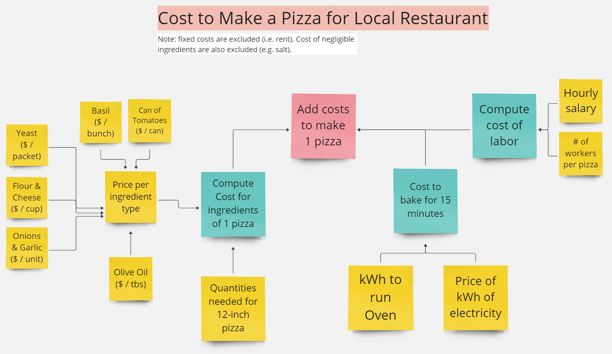

```{r setup, include=FALSE}
knitr::opts_chunk$set(echo = TRUE)
```

# link to model: https://miro.com/app/board/uXjVNtd33rc=/ 




### We are a group of hungry ladies that love pizza, and nothing beats a delicious Margherita pizza! As simple as a Margherita pizza may seem, there is so much more that goes on behind the scenes of pizza making, like the cost to operate ovens and employ workers. We want to know how much it costs our favorite local restaurant to make one beautiful pizza.

### In order to know how much it would cost to make one delicious Margherita pizza, we first have to find out how much of each ingredient we need for a single 12-inch pizza and determine the price of all these fresh ingredients based on units of measurement that make the most sense. For our sauce, we need to know how many cans of tomatoes and the cost per can. We also need to know how much basil will be needed for our pizza and how much each bunch of basil will cost. Of course, our dough is made of flour, yeast and water (which is a negligible cost in this case) and yeast is measured as cost per packet and flour as cost per cup. Pizza is not pizza without a cheesy layer, so we will also need to determine the amount of cheese required for our 12-inch pizza and how much it costs per cup. Next, we need to determine how much garlic and onion is needed for our pizza to be delicious and fragrant and cost is calculated per unit. Finally, a Margherita pizza would not be complete without a drizzle of finely pressed Italian olive oil, and the cost is calculated per tbs.

### Once the cost of all ingredients are determined, we need to determine the cost to bake the pizza and pay workers that actually make it. We need to know how many kWh of electricity are needed to run the oven for 15 minutes and the cost of each kWh of electricity. To compute the cost of labor required to make one pizza we need to know how many worked are involved in the making of one pizza, how much time each worker spends on the pizza, and what their hourly pay is.

### After we've compiled the costs of ingredients for one pizza, the cost to bake for 15 minutes, and the cost of labor for each pizza we can add them all up and determine the total cost for 1 pizza at our favorite local restaurant.

